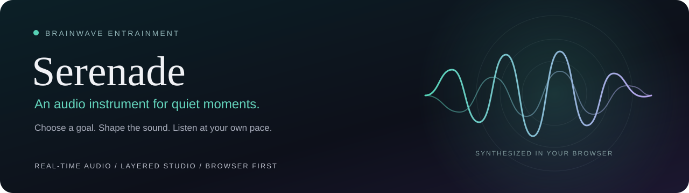
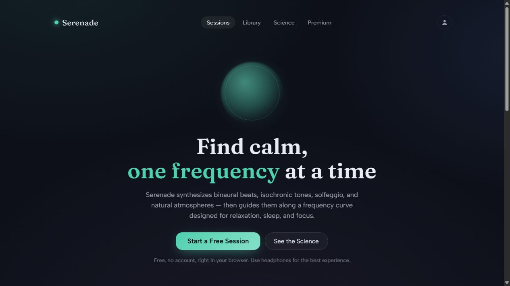
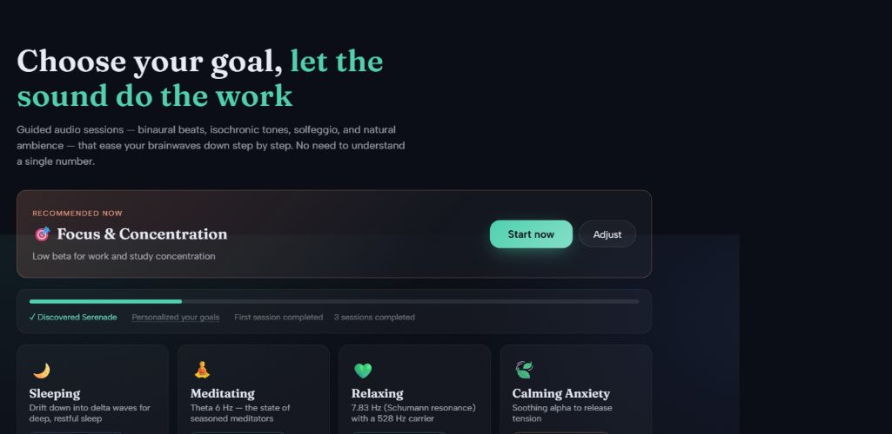
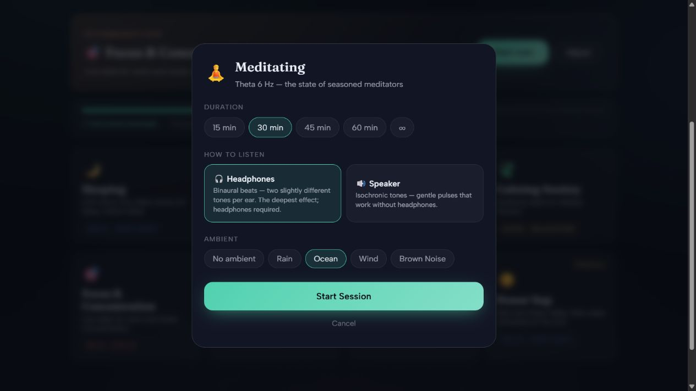
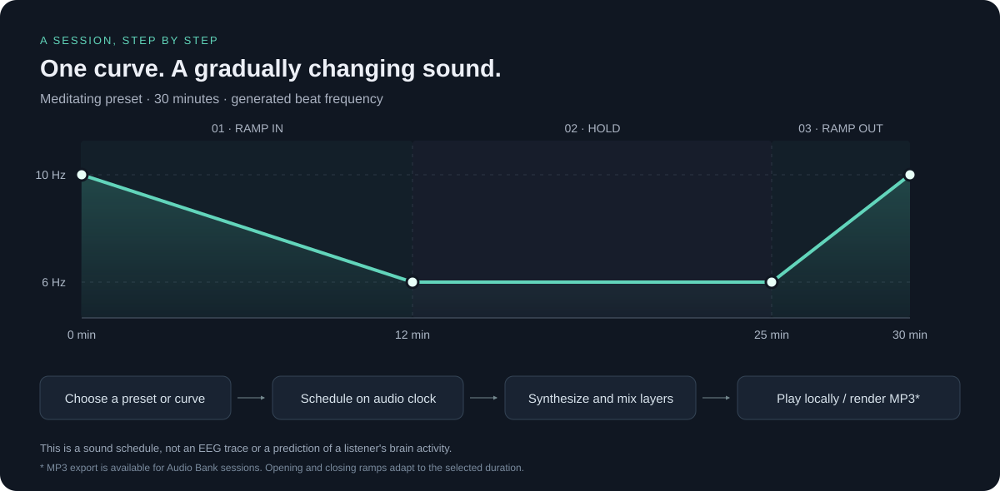
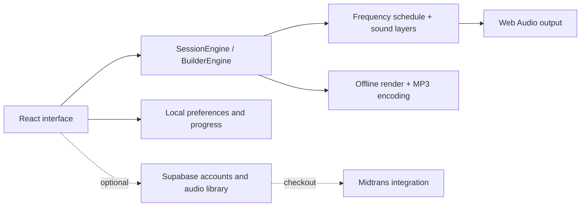

<p align="center">
  
</p>

<p align="center">
  <a href="https://github.com/arthamegayasa/brainwave-entrainment/actions/workflows/checks.yml"></a>
  
  
  
  
</p>

<p align="center">
  <a href="#get-started">Get started</a> ·
  <a href="#a-look-inside">Screenshots</a> ·
  <a href="#how-a-session-works">How it works</a> ·
  <a href="#development">Development</a> ·
  <a href="#science-and-scope">Science & scope</a>
</p>

# Serenade · Brainwave Entrainment

**Choose a listening goal. Shape the sound. Make room for a quieter moment.**

Serenade is a browser-based audio application for relaxation, meditation, sleep routines, and focused listening. It synthesizes its sound in real time: binaural beats, isochronic and monaural beats, pure tones, and nature-inspired ambience. A session can change gradually along a frequency curve instead of repeating a static tone.

The everyday experience starts with eight presets. An advanced Studio adds layered sound design, while an optional backend supports accounts, a clinician audio library, and payment integration.

> Serenade is an audio and relaxation tool, not a medical device. Session names describe listening intentions; they are not promises of clinical benefit.

## A look inside

<p align="center">
  
</p>

<details>
<summary><strong>Explore the session library and listening controls</strong></summary>

Eight goals provide a starting point, from Sleeping and Meditating to Focus & Concentration and Creative Flow.



Choose a duration, headphones or speakers, and a synthesized ambient layer before starting.



</details>

*Screenshots show the current local app in standalone mode. See [image notes](docs/images/README.md) for capture details.*

## What you can do

| Experience | What's implemented |
| --- | --- |
| **Start with a goal** | Eight presets, goal preferences, time-aware recommendations, and a local listening journey. |
| **Choose how to listen** | Binaural headphone mode or isochronic speaker mode; 15, 30, 45, 60 minutes, or an open-ended session. |
| **Blend the atmosphere** | Synthesized rain, ocean, wind, and brown noise with adjustable playback controls. |
| **Follow the session** | A live curve visualization, optional frequency details, smooth gain changes, and an end-of-session view. |
| **Design custom audio** | Studio layers for binaural, isochronic, monaural, pure tone, and ambience; per-layer gains, custom curves, harmonic frequency suggestions, and JSON import/export. |
| **Curate an audio library** | With a configured backend and clinician/admin role: an Audio Bank, reusable templates, patient invitations, and individual audio assignments. |
| **Export a session** | Audio Bank entries can be rendered locally and encoded as stereo MP3 files, with progress shown in the interface. |
| **Install the app** | A production PWA build caches the app shell and assets. Core synthesized listening can work offline after the app has loaded and been cached. |

**Access in this build:** preset and duration feature gates are currently unlocked by `ALL_UNLOCKED` in [`src/state/tier.ts`](src/state/tier.ts). Studio and Dashboard still have a separate clinician/admin role gate. Backend account, library, and payment operations need a network connection and their own configuration.

## Get started

Use **Node.js 22.12 or newer**, npm, and a browser with Web Audio support. The documented commands were checked with Node 24.19 and npm 11.17.

```bash
git clone https://github.com/arthamegayasa/brainwave-entrainment.git
cd brainwave-entrainment
npm ci
npm run dev
```

Open the local URL printed by Vite, normally **http://localhost:5173**. No API key, account, or backend is required for standalone preset listening.

1. Choose **Start a Free Session** and optionally personalize your goals.
2. Select a preset and session duration.
3. Choose **Headphones** for separate left/right binaural tones or **Speaker** for isochronic pulses.
4. Pick an ambience and press **Start Session**. Keep the volume comfortable.

<details>
<summary><strong>Preview the Studio without a backend</strong></summary>

The app includes a local development role override. In the browser console on your local app, run:

```js
localStorage.setItem("serenade.role.override", "clinician");
location.reload();
```

Studio becomes available for local sound design. Dashboard data, cloud publishing, patient assignments, and the Audio Bank require a configured backend; the override does not create those resources.

To return to the normal listener view:

```js
localStorage.removeItem("serenade.role.override");
location.reload();
```

The override is ignored when Supabase is configured. Connected deployments use the server profile and database access policies.

</details>

## How a session works

The session engine schedules **generated audio frequencies** against the audio clock. It does not measure EEG or verify a listener's brain state.



The illustration follows the current scheduler for a 30-minute **Meditating** session: a 12-minute opening ramp, a hold until minute 25, then a five-minute closing ramp. For short sessions, the scheduler caps opening and closing ramps at 40% and 20% of the selected duration. Sleeping has no closing frequency rise; open-ended sessions ramp to their target and hold until stopped.

| Sound layer | How the engine creates it |
| --- | --- |
| **Binaural** | Two tones are routed separately to the left and right channels. Their frequency difference defines the beat setting; headphones preserve the separation. |
| **Isochronic** | A tone is rhythmically amplitude-modulated, producing audible pulses. |
| **Monaural** | Two tones are mixed before output, creating a physical beat pattern. Available in Studio. |
| **Pure tone / solfeggio** | A single oscillator adds a chosen pitch or carrier. These are sound-design choices, not validated treatment frequencies. |
| **Ambience** | Noise synthesis and filtering create rain, ocean, wind, and brown-noise textures without streaming recordings. |

Gain ramps reduce abrupt clicks. The engines include a compressor/limiter, but device volume still determines listening loudness. Long MP3 exports render audio in memory and can be demanding on mobile devices.

## Architecture



The audio engine is plain TypeScript, independent of React. Preset definitions live in one place, and both the preset player and Studio reuse the scheduling and sound-layer modules.

```text
src/
  audio/                 Audio engine, presets, curves, layers, MP3 export
    layers/              Binaural, isochronic, monaural, pure tone, ambience
  state/                 Local preferences, progress, custom sessions, tiers
  ui/                    Home, Player, Studio, Library, Dashboard, Science
  lib/                   Optional accounts, roles, library, payment clients
tests/                   Audio render assertions and state tests
supabase/
  migrations/            Account, library, role, and clinician data schemas
  functions/             Transaction creation and payment webhook
docs/
  images/                Original diagrams and real product screenshots
  payments/              Integration design and historical sandbox notes
```

## Optional connected features

Standalone listening is the easiest starting point. To work on accounts, clinician workflows, or payments, use your own Supabase project and configure a local environment file:

```bash
cp .env.example .env.local
```

| Variable | Purpose |
| --- | --- |
| `VITE_SUPABASE_URL` | URL for your Supabase project. |
| `VITE_SUPABASE_ANON_KEY` | Browser-safe publishable/anonymous client key for that project. |
| `VITE_MIDTRANS_CLIENT_KEY` | Midtrans browser client key for checkout. Needed when testing payments. |

Frontend `VITE_*` values are included in the browser bundle. Server credentials belong in the backend, never in these variables or in Git.

The connected system also needs the schemas in [`supabase/migrations`](supabase/migrations), appropriate roles and access policies, Auth redirect settings, and the two Edge Functions in [`supabase/functions`](supabase/functions). Environment variables alone do not provision these services.

Read the [payment architecture](docs/payments/PAYMENTS-ARCHITECTURE.md) before changing checkout. The [sandbox notes](docs/payments/SANDBOX-SETUP.md) describe an earlier configured environment; substitute your own project and verify its current settings. They are not evidence of a working payment deployment for a fresh clone. Preset feature gating still needs integration with server entitlements before it can be treated as a production paywall.

## Development

| Command | Purpose |
| --- | --- |
| `npm ci` | Install the committed dependency versions. |
| `npm run dev` | Run the Vite development server. |
| `npm test` | Run Vitest, including real offline audio rendering with `node-web-audio-api`. |
| `npm run build` | Type-check, build the app, and generate the PWA service worker. |
| `npm run preview` | Serve the production build locally. |

The suite checks rendered signals, pulse counts, fades, scheduling, layer behavior, MP3 export, imported-session validation, and local state. At the documentation refresh, **110 tests across 16 files passed**, and the production build completed.

For contributions, keep audio logic in `src/audio`, keep preset constants centralized, and include a focused test for behavior changes. Run the test suite and production build before opening a pull request. Implementation decisions and gotchas are recorded in [DECISIONS.md](DECISIONS.md) and [KNOWLEDGE.md](KNOWLEDGE.md).

**Platform notes**

- Playback begins from a user gesture because browsers restrict autoplay.
- PWA installation and offline caching should be checked using the production build served over HTTPS or localhost. Backend operations remain online features.
- Mobile operating systems may suspend browser audio in the background. Media Session controls improve integration but do not guarantee uninterrupted playback on iOS.
- There is no dedicated lint command in the current package scripts. The build includes TypeScript checking.

## Science and scope

Serenade exposes how its sound is constructed and includes a [Science page](src/ui/Science.tsx) with supporting and conflicting research. Evidence for a reliable binaural-beat brainwave entrainment effect remains inconsistent; a systematic review of 14 EEG studies reported mixed findings and substantial methodological differences. [Ingendoh, Posny & Heine, PLOS ONE (2023)](https://doi.org/10.1371/journal.pone.0286023).

Specific solfeggio pitches and session names should be understood as listening preferences and design labels. This repository does not establish that those frequencies diagnose, treat, or prevent a health condition.

---

Created by [Nyoman Artha Megayasa](https://github.com/arthamegayasa). A license has not yet been selected for this repository.
